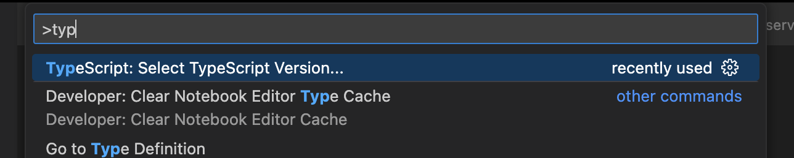
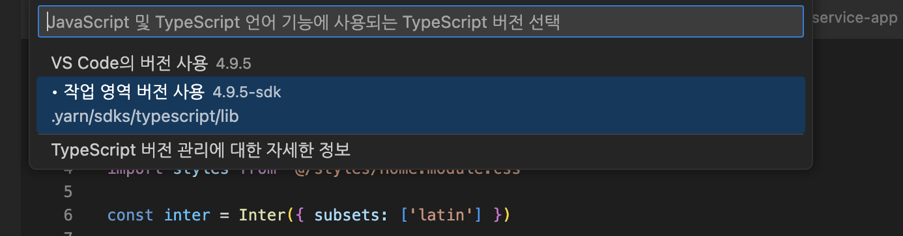

# monorepo-boilerplate 만들기!

## monorepo 란

하나의 git repository 에 여러개의 프로젝트가 구성된 것을 의미한다 _\* 일반적인 프로젝트 구성은 `Multi-repo`, `PolyRepo`_

### 모노레포의 장점

- 하나의 repo 에서 여러개의 프로젝트를 관리할 수 있다.
- 중첩되는 코드를 공유해서 쓸 수 있다.

## Yarn workspace

monorepo 를 구성하는 방법은 여러가지가 있지만 그중 나는 `Yarn workspace` 를 사용하였다.

### Yarn berry

이 부분은 선택사항인데 나는 Yarn berry 를 사용해 의존성 파일을 관리하였다.
_자세한 내용은 다른 포스팅에 정리할 예정_

yarn berry 를 사용했을 때 이점은 다음과 같다

- Plug’n’Play (PnP)
  - node_modules 디렉토리 구조를 생성할 필요가 없다.
  - 각 패키지는 버전마다 하나의 Zip 아카이브만을 가지기 때문에 중복해서 설치되지 않는다

프로젝트의 규모가 작을 때는 느끼지 못할 수 있지만 규모가 커지면 스토리지가 절약 되는 것을 느낄 수 있을 듯 하다.

- zero-install
  - 의존성을 git에서 관리한다. PnP 는 의존성 파일을 Zip 으로 관리하여 용량이 적고 파일 갯수도 적기 때문에 git 에서 관리할 수 있다.
  - 저장소를 복제하거나 브랜치를 바꿔도 install 을 하지 않다도 된다. CI 에서 의존성 설치하는 시간이 줄어든다.

## monorepo 만들기

```shell
mkdir monorepo 패키지 생성
yarn version berry
yarn -v // 3.4.1

yarn init
```

_`yarn.lock` 파일이 생성 되지 않은 경우 yarn init 을 한번 더!_

```json
{
  "name": "monorepo-pr",
  "packageManager": "yarn@3.4.1",
  // 아래 내용 추가
  "workspaces": [
    "shared/*", // shared code
    "services/*" // service code
  ]
}
```

```bash
├── shared
│   └── 공유 코드
├── services
│   └── 서비스 코드 위치
├── package.json
├── yarn.lock
├── package.json
└── run.sh
```

```shell
cd services
npx create-next-app@latest --ts
```

services 위치에 next app 설치
_npx 를 사용하는 경우 node_modules 폴더 와 package.lock 파일이 생성 됨으로 두개는 삭제한다_

## next app 설치

1. `name` 을 `@services/app` 처럼 수정한다.
2. dependencies 를 복사해서 root/package.json 에 가져온다.
3. root 경로에서 yarn 으로 필요한 패키지들을 설치해준다.
4. root 의 packages.json의 scripts 를 추가한다.
5. `yarn next dev` 명령어를 사용하여 next app 실행

```json
...
  "scripts": {
    "next": "yarn workspace @service/app"
  },
  "dependencies": {
    "@types/node": "18.15.0",
    "@types/react": "18.0.28",
    "@types/react-dom": "18.0.11",
    "eslint": "8.36.0",
    "eslint-config-next": "13.2.4",
    "next": "13.2.4",
    "react": "18.2.0",
    "react-dom": "18.2.0",
    "typescript": "4.9.5"
  }
  ...
```

next-app 에 사용되는 의존성들은 root 에서 관리한다.

> yarn berry 를 사용할 경우 typescript 에러가 발생하는 경우가 있다.
> 아래 의존성을 설치하고 사진과 같이 typeScript 버전을 선택해준다
> <br/> `yarn dlx @yarnpkg/sdks vscode`  

## typescript 설정

1. root 경로에 `tsconfig.base.json` 파일을 생성하여 전체 프로젝트의 ts 규칙을 관리한다.

```json
{
  "compilerOptions": {
    "target": "es2016",
    "module": "esnext",
    "esModuleInterop": true,
    "forceConsistentCasingInFileNames": true,
    "strict": true,
    "skipLibCheck": true,
    "lib": ["dom", "dom.iterable", "esnext"],
    "allowJs": true,
    "noEmit": true,
    "moduleResolution": "node",
    "resolveJsonModule": true,
    "isolatedModules": true,
    "incremental": true,
    "paths": {
      "*": ["./src/*"]
    }
  },
  "exclude": ["node_modules", "dist"]
}
```

2. services/next-app/tsconfig.json

```json
{
  "extends": "../../tsconfig.base.json",
  "compilerOptions": {
    "jsx": "preserve",
    "baseUrl": "."
  },
  "include": ["next-env.d.ts", "**/*.ts", "**/*.tsx"]
}
```

## common component

### 공유 컴포넌트 생성

```shell
$ cd shared
$ mkdir component

$ cd component
$ yarn init -y

$ mkdir src
```

shared/package.json

```json
{
  "name": "@common/component",
  "packageManager": "yarn@3.3.1",
  "main": "dist/index",
  "types": "dist/index",
  "files": ["dist"],
  "scripts": {
    "build": "yarn clean && yarn compile",
    "clean": "rimraf -rf ./dist",
    "compile": "tsc"
  },
  "devDependencies": {
    "@types/react": "^18",
    "@types/react-dom": "^18",
    "@types/rimraf": "^3",
    "rimraf": "^3.0.2",
    "typescript": "^4.9.4"
  },
  "dependencies": {
    "react": "^18.2.0",
    "react-dom": "^18.2.0"
  }
}
```

shared/src

```bash
├── shared
│   └── component
│      ├── src
│      │    ├── index.ts
│      │    └── Button.tsx
│      └── package.json
├── services
│   └── 서비스 코드 위치
├── package.json
├── yarn.lock
├── package.json
└── run.sh
```

root/packages.json

```json
...
scripts:{
  "component": "yarn workspace @common/component"
}
...
```

```shell
yarn component add -D rimraf
yarn component -D typescript

yarn component build
```

root 폴더에서 yarn 으로 install

### next 설정

services/next-app/tsconfig.json

```json
{
  "compilerOptions": {
    ...
    "paths": {
      "@pnds/component": ["../../shared/components/src"],
    }
    ...
  },
}
```

services/next-app/next.config.js

```js
const nextConfig = {
  ...
  // 아래 항목 추가
  experimental: {
    externalDir: true,
  },
};

```

index.tsx

```tsx
import { Button } from "@common/component";

const Component = () => {
  return (
    <div>
      <Button />
    </div>
  );
};
```
