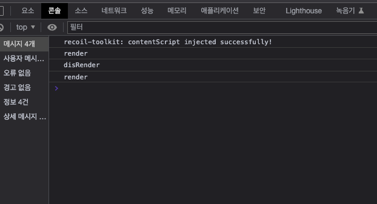

# 올바른 useEffect 사용하기

react18 버전의 StrictMode에서는 개발모드에서 useEffect 를 사용하면 아래 처럼 data fetching 이 두 번 호출되는 경우를 확인 할 수 있다.

```jsx
useEffect(() => {
  console.log("render");
  return () => {
    console.log("disRender");
  };
}, []);
```



react18 은 페이지 이동 이후 다시 돌아왔을때 앱이 망가지는 부분이 없는지 확인하기 위해 개발모드에서 한 컴포넌트를 두번 렌더링한다.

<br/>

## 해결방법

<br/>

### StrictMode 를 사용하지 않음

- Production 환경에서 일어날 수 있는 오류를 잡아주지 못함으로 좋은 방법은 아님

<br/>

### Effect 가 두번 일어나도 유저가 느끼지 못하게 설계

~~`어떻게 하면 Effect를 한번만 동작할 수 있게 할까?`~~ → useEffect 가 두 번씩 호출 되어도 어떻게 유저가 리렌더링을 느끼지 못하게 할까?

<br/>

### Clean up 함수 작성

- 개발 모드에선 effect → CleanUp → effect 순서로 컴포넌트를 실행시키기 때문에 Cleanup 함수가 필요한 부분은 꼭 생략하지 않고 챙겨야한다.
- useEffect 내부에서 setState 함수를 호출하면 clean up 함수와는 무관하게 setState가 두번 호출됨으로 setState 는 useEffect 내부에서 돌리지 않도록 하는 것이 좋음

```jsx
// Bad Case
function TodoList({ todos, filter }) {
  const [newTodo, setNewTodo] = useState("");

  const [visibleTodos, setVisibleTodos] = useState([]);
  useEffect(() => {
    // 🔴 Bad 아래 setState 는 2번 호출된다 만약 statck 형식등일 경우엔 데이터가 두번 쌓인다.
    setVisibleTodos(getFilteredTodos(todos, filter));
  }, [todos, filter]);

  // ...
}
```

- useEffect 내부에서 상태 업데이트를 하지 않는다면 개발환경과 무관하게 useEffect의 호출 횟수에 따른 UI/UX 가 달라질 이유는 없다. `ex) window.addEventListener`

```jsx
useEffect(() => {
  function handleScroll(e) {
    console.log(e.clientX, e.clientY);
  }
  window.addEventListener("scroll", handleScroll);
  return () => window.removeEventListener("scroll", handleScroll);
}, []);
```

<br/>

### Props, State 변경에 따라 또다른 state 를 업데이트 할 때

- useEffect 사용 X → _컴포넌트는 Props 가 변경 될 때 마다 리랜더링 하는 것을 이용 함._

```jsx
function TodoList({ todos, filter }) {
  const [newTodo, setNewTodo] = useState("");
  // ✅ Good
  const visibleTodos = getFilteredTodos(todos, filter);
  // getFilteredTodos 함수가 비싼 연산일 경우 useMemo 를 사용한다.
  const visibleTodos = useMemo(
    () => getFilteredTodos(todos, filter),
    [todos, filter]
  );
  // ...
}
```

컴포넌트가 리렌더링 될 때마다 visibleTodos가 업데이트 되기 때문에 최신 데이터 반영할 수 있다.

<br/>

### props 변경에 따라 상태가 리셋되어야 하는 경우.

컴포넌트를 분리하여 props 값이 변경 될 때마다 필요한 부분만 리랜더링 할 수 있도록 한다.

```jsx
export default function ProfilePage({ userId }) {
  return <Profile userId={userId} key={userId} />;
}

function Profile({ userId }) {
  // ✅ This and any other state below will reset on key change automatically
  const [comment, setComment] = useState("");
  // ...
}
```

<br/>

### Props 변경에 따라 특정 상태만 업데이트 하는 경우

```jsx
function List({ items }) {
  const [isReverse, setIsReverse] = useState(false);
  const [selection, setSelection] = useState(null);

  // Better: Adjust the state while rendering
  const [prevItems, setPrevItems] = useState(items);
  if (items !== prevItems) {
    setPrevItems(items);
    setSelection(null);
  }
  // ...
}
```

State에 items 상태를 담고, prevItems와 items를 비교하여 첫 렌더링시 if statement를 통해 렌더링 횟수를 줄인다.

<br/>

## Data fetching

useEffect 내부에서 api 호출이 일어날 경우 역시 두번 동작한다. 단순한 시나리오는 문제 없지만 서버 비용이 두배가 될 수 있다.
컴포넌트가 여러번 마운트 → 언마운트 → 마운트 되더라도 동일한 api를 호출하는 경우, 이전에 받아온 데이터를 재사용한다면 서버 자원이 부족할 문제는 피할 수 있다. 가장 좋은 방법은 `react-query` 를 사용하여 처리하는 것이다.
